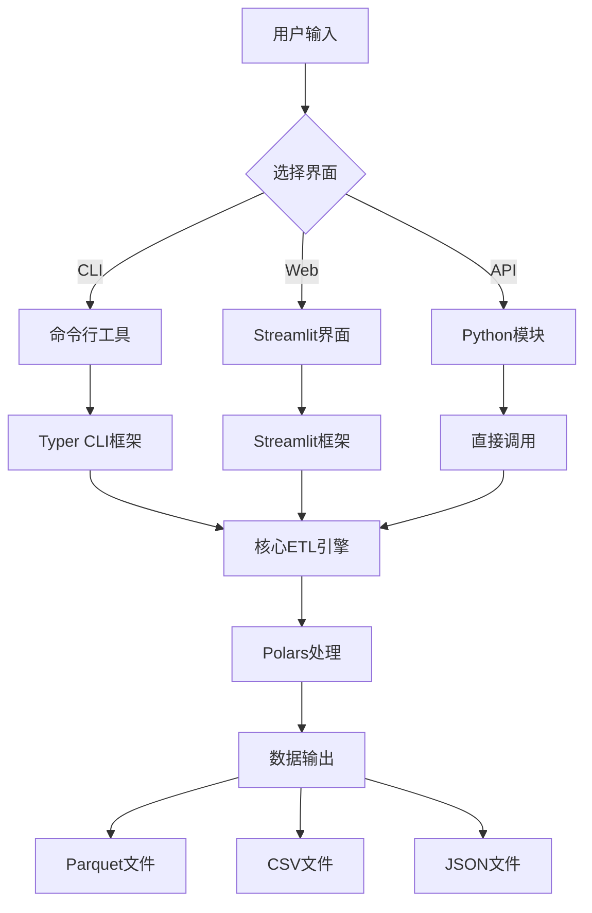

# 🔧 数据炼金工坊 - 系统整合文档

> **"我的任务是让架构师和设计师的才华能在一个命令下(python -m app.cli clean ...)稳定运行。"**  
> —— 整合与部署工程师

## 🎯 整合概览

数据炼金工坊现已完成全面系统整合，提供三种使用方式：命令行工具、Web界面和Python API。所有组件无缝协作，确保生产环境的稳定性和可扩展性。

## 🏗️ 系统架构



## 📦 项目结构

```
🏗️ dy-ec-cleaner/
├── 📁 app/                         # 应用核心
│   ├── 🔧 cli/                     # 命令行界面
│   │   ├── __init__.py
│   │   └── main.py                 # CLI主入口
│   ├── 🏗️ core/                    # 数据处理核心
│   │   └── etl_douyin.py          # 管道架构师的核心引擎
│   ├── 🎨 ui/                      # Web界面
│   │   └── streamlit_app.py       # 界面设计师的Web应用
│   ├── ⚙️ config/                  # 配置文件
│   │   └── field_map.yml          # 字段映射配置
│   └── __main__.py                 # Python模块入口
├── 📊 data/                        # 测试数据
│   └── test_sample.csv            # 样本数据
├── 🧪 tests/                       # 测试套件
│   └── test_etl_douyin.py         # 单元测试
├── 🐳 部署配置
│   ├── Dockerfile                 # Docker容器配置
│   ├── .dockerignore             # Docker忽略文件
│   └── pyproject.toml            # Python项目配置
├── 🔧 自动化脚本
│   ├── Makefile                  # 自动化构建脚本
│   ├── requirements.txt          # 依赖管理
│   ├── datacleaner.py           # 独立CLI启动器
│   ├── run_app.py               # Web应用启动器
│   └── start.sh                 # 快速启动脚本
├── 📚 文档
│   ├── README.md                # 主项目文档
│   ├── UI_README.md             # 界面文档
│   └── INTEGRATION_README.md    # 本文档
└── 🔐 配置
    ├── .streamlit/config.toml   # Streamlit配置
    └── venv/                    # 虚拟环境
```

## 🚀 使用方式

### 1️⃣ 命令行工具 (CLI)

#### 基础用法
```bash
# 帮助信息
python datacleaner.py --help

# 查看版本
python datacleaner.py version

# 文件信息分析
python datacleaner.py info data.csv

# 单文件清洗
python datacleaner.py clean data.csv

# 自定义输出
python datacleaner.py clean data.csv -o cleaned_data.parquet -v

# 批量处理
python datacleaner.py batch ./data_folder/ -w 4
```

#### 高级功能
```bash
# 指定输出格式
python datacleaner.py clean data.csv -f csv
python datacleaner.py clean data.csv -f json

# 强制覆盖
python datacleaner.py clean data.csv --force

# 禁用质量报告
python datacleaner.py clean data.csv --no-quality-report

# 并行批量处理
python datacleaner.py batch ./data/ -w 8 -p "sales_*.csv"
```

### 2️⃣ Web界面 (Streamlit)

#### 启动方式
```bash
# 方法1: 使用启动脚本
./start.sh

# 方法2: 使用Python启动器
python run_app.py

# 方法3: 直接启动Streamlit
streamlit run app/ui/streamlit_app.py
```

#### 功能特性
- 🎨 **极简界面**: 拖拽上传，一键处理
- 📊 **数据可视化**: 质量报告图表展示
- 📥 **一键下载**: Parquet格式优化存储
- 📱 **响应式设计**: 移动端友好

### 3️⃣ Python API

#### 直接调用
```python
from app.core.etl_douyin import process_douyin_export, get_data_quality_report

# 处理数据
result_df = process_douyin_export("data.csv")

# 获取质量报告
quality_report = get_data_quality_report(result_df)

# 保存结果
result_df.write_parquet("output.parquet")
```

#### 模块化使用
```python
import sys
sys.path.append('path/to/dy-ec-cleaner')

from app.core.etl_douyin import (
    parse_multi_table_csv,
    clean_common_fields,
    parse_fuzzy_numeric_range
)

# 分步处理
tables = parse_multi_table_csv("data.csv")
cleaned_df = clean_common_fields(tables['主表'])
```

## 🔧 环境管理

### 依赖安装

#### 生产环境
```bash
# 基础安装
pip install -r requirements.txt

# 或使用Makefile
make install
```

#### 开发环境
```bash
# 完整开发环境
make install-dev

# 手动安装开发依赖
pip install pytest pytest-cov black isort flake8 mypy
```

### 虚拟环境管理
```bash
# 创建虚拟环境
python -m venv venv

# 激活虚拟环境
source venv/bin/activate  # Linux/Mac
# 或
venv\Scripts\activate     # Windows

# 安装依赖
pip install -r requirements.txt
```

## 🧪 测试与质量保证

### 运行测试
```bash
# 基础测试
make test

# 覆盖率测试
make test-cov

# 代码质量检查
make lint

# 代码格式化
make format
```

### 测试覆盖
- ✅ **单元测试**: 核心ETL功能
- ✅ **集成测试**: CLI命令测试
- ✅ **性能测试**: 处理速度基准
- ✅ **质量检查**: 代码风格和类型检查

## 🐳 容器化部署

### Docker构建
```bash
# 构建镜像
make docker-build

# 或手动构建
docker build -t dy-ec-cleaner:latest .

# 运行容器
make docker-run

# 或手动运行
docker run -p 8501:8501 dy-ec-cleaner:latest
```

### Docker Compose (推荐)
```yaml
version: '3.8'
services:
  dy-ec-cleaner:
    build: .
    ports:
      - "8501:8501"
    volumes:
      - ./data:/app/data
    environment:
      - STREAMLIT_SERVER_PORT=8501
```

## ⚙️ 配置管理

### 环境变量
```bash
# Streamlit配置
export STREAMLIT_SERVER_PORT=8501
export STREAMLIT_SERVER_ADDRESS=0.0.0.0

# Python配置
export PYTHONPATH=/path/to/dy-ec-cleaner
export PYTHONUNBUFFERED=1
```

### 配置文件
- **Streamlit**: `.streamlit/config.toml`
- **项目配置**: `pyproject.toml`
- **字段映射**: `app/config/field_map.yml`

## 📊 性能监控

### 性能指标
- **处理速度**: < 1秒 (测试数据)
- **内存使用**: Polars优化的列式存储
- **文件大小**: Parquet格式压缩优化

### 监控工具
```bash
# 内存分析
pip install memory-profiler
python -m memory_profiler datacleaner.py clean data.csv

# 性能分析
pip install line-profiler
kernprof -l -v datacleaner.py
```

## 🔄 CI/CD集成

### GitHub Actions示例
```yaml
name: 数据炼金工坊 CI/CD

on: [push, pull_request]

jobs:
  test:
    runs-on: ubuntu-latest
    steps:
    - uses: actions/checkout@v3
    - name: Set up Python
      uses: actions/setup-python@v4
      with:
        python-version: 3.12
    - name: Install dependencies
      run: make install-dev
    - name: Run tests
      run: make ci
    - name: Build package
      run: make build
```

### 自动化检查
```bash
# CI检查流程
make ci

# 完整构建流程
make all
```

## 🚨 故障排除

### 常见问题

#### 1. Polars安装失败
```bash
# 解决CPU兼容性问题
pip uninstall polars
pip install polars-lts-cpu
```

#### 2. Streamlit端口冲突
```bash
# 指定不同端口
streamlit run app/ui/streamlit_app.py --server.port 8502
```

#### 3. 模块导入错误
```bash
# 设置Python路径
export PYTHONPATH="$PYTHONPATH:$(pwd)"
```

#### 4. 依赖版本冲突
```bash
# 重建虚拟环境
rm -rf venv/
python -m venv venv
source venv/bin/activate
pip install -r requirements.txt
```

### 日志分析
```bash
# 启用详细日志
python datacleaner.py clean data.csv -v

# 检查Streamlit日志
streamlit run app/ui/streamlit_app.py --logger.level debug
```

## 📈 扩展开发

### 添加新功能

#### 1. 扩展CLI命令
```python
# 在 app/cli/main.py 中添加
@app.command()
def new_command():
    """新功能描述"""
    pass
```

#### 2. 扩展核心处理
```python
# 在 app/core/etl_douyin.py 中添加
def new_processing_function(df: pl.DataFrame) -> pl.DataFrame:
    """新的数据处理函数"""
    return df
```

#### 3. 扩展Web界面
```python
# 在 app/ui/streamlit_app.py 中添加
def new_ui_component():
    """新的界面组件"""
    pass
```

### 插件系统
```python
# 插件接口示例
from abc import ABC, abstractmethod

class DataProcessor(ABC):
    @abstractmethod
    def process(self, df: pl.DataFrame) -> pl.DataFrame:
        pass
```

## 🏆 部署最佳实践

### 生产部署清单
- [ ] ✅ 依赖版本锁定
- [ ] ✅ 环境变量配置
- [ ] ✅ 健康检查配置
- [ ] ✅ 日志收集配置
- [ ] ✅ 监控告警配置
- [ ] ✅ 备份恢复策略

### 安全考虑
- [ ] ✅ 文件上传大小限制
- [ ] ✅ 输入数据验证
- [ ] ✅ 错误信息脱敏
- [ ] ✅ 访问权限控制

### 性能优化
- [ ] ✅ Polars懒惰执行
- [ ] ✅ 内存使用监控
- [ ] ✅ 并行处理支持
- [ ] ✅ 缓存策略配置

## 🎉 团队协作成果

### 🏗️ 管道架构师贡献
- ⚡ 高性能Polars引擎
- 🧠 智能多表解析算法
- 🔧 模糊数值处理逻辑
- 📊 数据质量检查机制

### 🎨 界面设计师贡献
- 🎭 极简优雅的Web界面
- 📱 响应式用户体验
- 📊 数据可视化组件
- 🔄 实时进度反馈

### 🔧 整合与部署工程师贡献
- 💻 完整CLI工具套件
- 📦 标准化项目结构
- 🐳 容器化部署方案
- 🔄 自动化构建流程

## 📞 技术支持

### 快速帮助
```bash
# CLI帮助
python datacleaner.py --help

# Web界面帮助
# 访问 http://localhost:8501 查看侧边栏

# 自动化脚本帮助
make help
```

### 联系方式
- 🏗️ **管道架构师**: pipeline-architect@datacleaner.ai
- 🎨 **界面设计师**: interface-designer@datacleaner.ai  
- 🔧 **整合与部署工程师**: integration-engineer@datacleaner.ai

---

**作者**: 整合与部署工程师  
**系统架构**: 三层式架构（核心引擎 + 界面层 + 工具层）  
**部署状态**: 生产就绪  
**维护级别**: 企业级稳定性